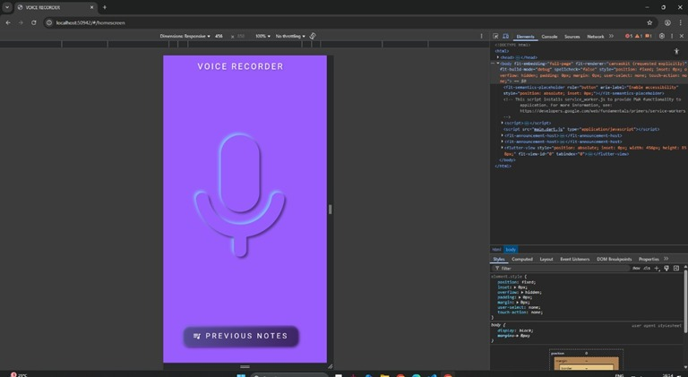
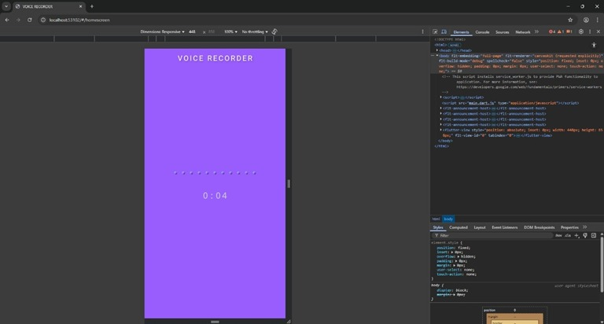
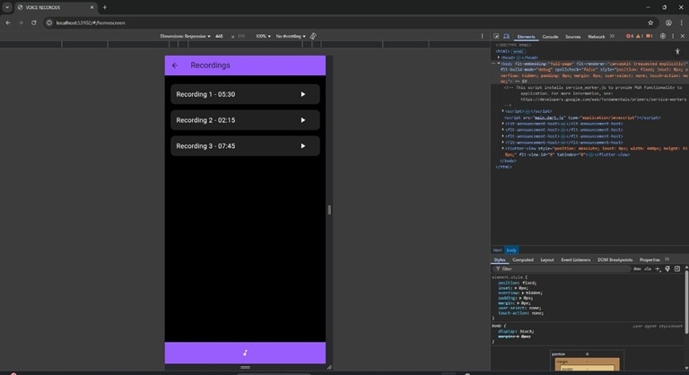
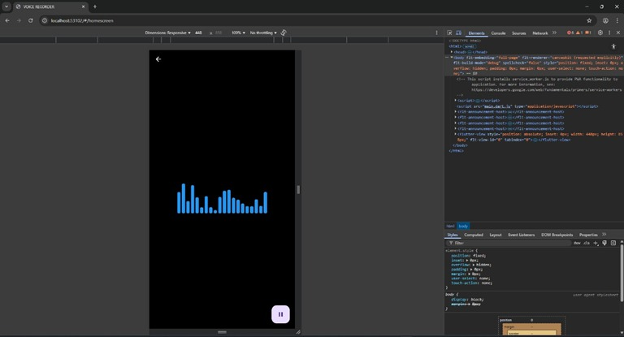

# Voice Recorder App (Flutter)

This is a minimal yet effective voice recording app developed using the Flutter framework. It captures high-quality audio, saves it locally, and provides playback and deletion features through a clean, intuitive UI.

---

## Features

- Start / Stop / Pause recording
- Play saved recordings
- Delete recordings
- Real-time amplitude visualizer
- Files stored with unique `.rn` extensions
- Built using Flutter Bloc for state management

---

## Screenshots

### 1. Home Screen  


### 2. Recording Screen  


### 3. Recordings List  


### 4. Playback + Voice Bar  


---

## Architecture

- `RecordCubit`: Manages microphone permissions, recording states, and audio input.
- `FilesCubit`: Manages file storage, listing, and deletion.
- UI dynamically responds to state changes for seamless user experience.

The file format `.rn` is used for branding, while recordings are actually saved in standard formats (e.g., `.m4a`) internally.

---

## Key Packages Used

| Package            | Purpose                                      |
|--------------------|----------------------------------------------|
| `record`           | Audio capture and amplitude stream           |
| `just_audio`       | Playback with controls                       |
| `flutter_bloc`     | State management with Cubit architecture     |
| `permission_handler` | Handles runtime permissions                 |
| `path_provider`    | File storage directories                     |

---

## 📄 Assignment Report

[Download Full Report (PDF)](Voice_Recorder_Report.pdf)

---

## How to Run

### Prerequisites

- Flutter SDK
- Android Studio / VS Code
- Device or emulator with mic permission

### Setup

```bash
git clone [https://github.com/yourusername/voice_recorder_flutter.git](https://github.com/ANewShaman/VoiceRecorderUI.git)
cd voice_recorder_flutter
flutter pub get
flutter run
